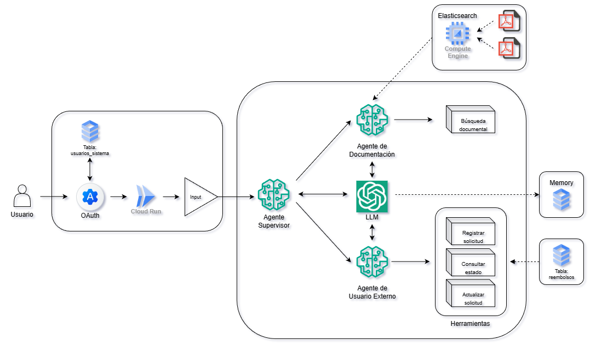

# 🩺 Multiagente de Solicitudes de Reembolsos Médicos
Este proyecto implementa un **multi-agente conversacional** para la gestión automatizada de solicitudes de reembolsos médicos, aprovechando la orquestación avanzada de **LangGraph**. La arquitectura está diseñada para el despliegue en entornos serverless como **Cloud Run (GCP)**.

## Este sistema integra:

* **LangGraph**: Como *framework* central de orquestación, utilizando un **nodo supervisor** para enrutar las consultas.
* **PostgreSQL**: Para la gestión **transaccional (CRUD)** de solicitudes médicas.
* **Elasticsearch (RAG)**: Como base de datos vectorial para la **Recuperación Aumentada de Generación (RAG)** de documentación y políticas.
* **RBAC (Control de Acceso Basado en Roles)**: Asegura que las herramientas y datos se usen según los permisos del usuario (`Administrador` o `General`).
* **Memoria Persistente**: Utiliza `PostgresSaver` para mantener el estado de la conversación entre sesiones.

## 🚀 Requisitos y Configuración Inicial

La aplicación está diseñada para ser un servicio de *backend* desplegado en **Google Cloud Run** y consumido por un *frontend* separado.

### Instalación de Dependencias

Ejecuta el siguiente comando para instalar todas las librerías necesarias (LangChain, LangGraph, Flask, Elasticsearch, SQLAlchemy, etc.):

```bash
pip install -r requirements.txt
```

### - Configuración de variables de entorno

Para ejecutar el código necesitas los siguientes archivos en las ubicaciones específicas:

| Variable | Descripción |
| :--- | :--- |
| **`OPENAI_API_KEY`** | Clave de acceso para `gpt-4o-mini` y `text-embedding-3-large`. |
| **`POSTGRES_URI`** | Cadena de conexión URI para PostgreSQL. |
| **`ELASTIC_URL`** | URL del servidor de Elasticsearch. |
| **`ELASTIC_USER`** | Usuario para la conexión a Elasticsearch. |
| **`ELASTIC_PASSWORD`** | Contraseña para la conexión a Elasticsearch. |
| **`ELASTIC_INDEX`** | Nombre del índice para la búsqueda de documentación. |
| **`LANGCHAIN_API_KEY`** | Clave para el seguimiento de trazas en LangSmith.. |
| **`LANGCHAIN_PROJECT`** | Nombre del proyecto en LangSmith. |

---

## ⚙️ Instrucciones de despliegue en Cloud Run (GCP)

La aplicación es un servicio HTTP (`app.py`) por lo que se debe desplegar como un contenedor:

1.  **Contenedorización**: Crea un `Dockerfile` que instale las dependencias y ejecute la aplicación (ej. `CMD ["python", "app.py"]`).
2.  **Registro de Imagen**: Construye la imagen docker y súbela a Google Artifact Registry (o Docker Hub).
3.  **Despliegue**: Despliega la imagen en Cloud Run, asegurándote de inyectar todas las **variables de entorno** sensibles definidas en la sección de configuración. Cloud Run se encargará de gestionar el escalado y el puerto de escucha.

## 🧠 Arquitectura del agente


